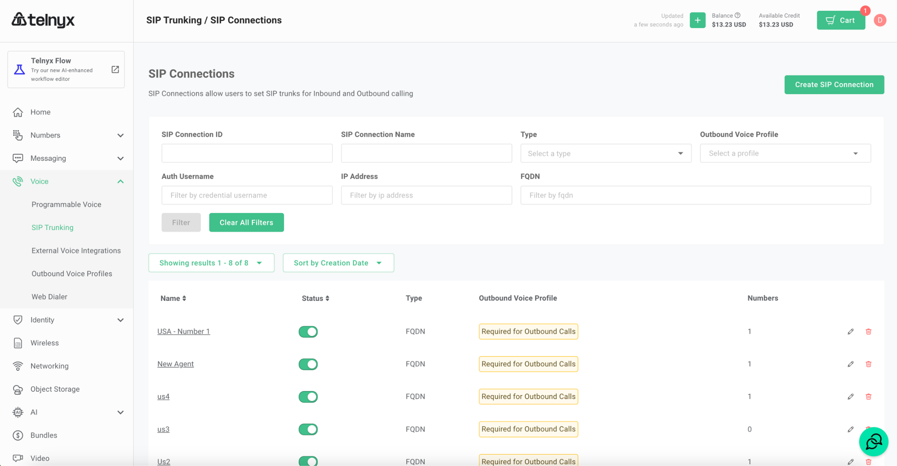
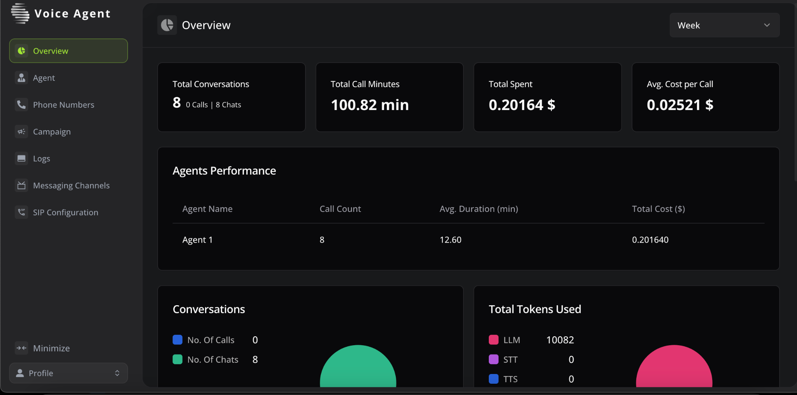
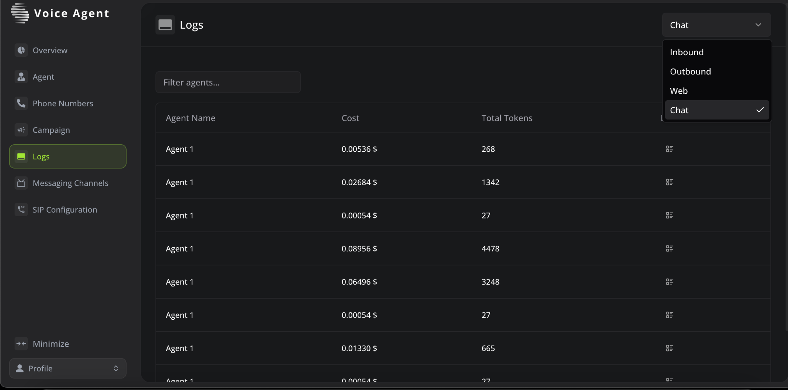

# Welcome

Welcome to the Swarmchain Agent Documentation. This comprehensive guide will provide you with the knowledge and tools needed to excel in your role, whether you're on the phone or engaging with customers through chat. Let's collaborate to provide outstanding customer service and achieve our shared goals.

# Sign In and Sign Up

This document explains how to use the **Sign In** and **Sign Up** pages for the Voice Agent platform.


## Sign In

To access your Voice Agent dashboard, follow these steps:

1. **Open the Voice Agent login page**.

- The login form includes fields for **Email** and **Password**.

- **Enter your credentials**:

- In the **Email** field, enter your registered email address.

- In the **Password** field, enter your password.

- You can toggle the visibility of the password by clicking the eye icon next to the password field.

- **Click "Sign In"** to access your account.

If you encounter any issues signing in:

- **Forgot your password?**

- Click the **"Forgot your password?"** link to reset your password.

## Sign Up

If you don't have an account, follow these steps:

1. **Click the "Sign Up" link** located below the sign-in form.

2. **Fill out the required details**:

- You will need to provide an email address and create a password.

- **Complete the registration** by following the on-screen instructions to create your account.

Once signed up, you can log in using the **Sign In** form.


If you experience any difficulties, please contact our support team for assistance.

# Creating Agents

This section explains how to create and configure agents in the Voice Agent platform. Agents can be voice AI chatbots used for various integrations into your applications. You can configure these agents to fit your business needs.

## Step 1: Access the Agents Section

1. Navigate to the **Agents** tab in the Voice Agent dashboard.

2. Click on the **Create Agent** button to begin the agent creation process.

## Step 2: Define Agent Details

In the "Create Agent" form, you'll be asked to provide the following details:

- **Agent Name**: Enter a unique name for your agent.

- **Type**: Choose between two types of agents:

- **Phone**: This agent will be associated with a phone number.

- **Web**: This agent will operate through a web interface, and does not require a phone number.

## Step 3: Configure Agent Based on Type

### 1. **Phone Agent**:

- When selecting the **Phone** type, you must associate the agent with an existing phone number.

- Ensure that the phone number has already been created on the platform (more details on creating phone numbers will be provided later).

### 2. **Web Agent**:

- If you select **Web**, no phone number is required.

## Step 4: Choose a Template

- You will be provided with five templates to choose from. These templates help to simplify the configuration of your agent.

- Templates include basic configurations and can be further customised based on your needs.

- Select any one of the templates that best suits your use case:

- **Default Template**: This template comes with minimal configurations and serves as a blank slate for further customization.

## Step 5: Finalise Creation

- After filling in all the necessary information and selecting a template, click on the **Create Agent** button to complete the process.


If you need further assistance creating or managing agents, please refer to the platform's support documentation or contact support.


# Importing Phone Numbers

In this section, you can import purchased phone numbers into the Voice Agent platform. Currently, the system supports phone number imports from **Telynx**.

## Step 1: Access the Phone Numbers Section

1. Navigate to the **Phone Numbers** tab in the Voice Agent dashboard.

2. Click on the **Import** button to begin importing a phone number.

## Step 2: Fill in the Required Fields

You will need to provide the following details to import a phone number:

- **Label**: Enter a label for the phone number, which will help you identify it in the platform.

- **Telynx Phone Number**: Enter your phone number and make sure to select the correct country code.

- **Telynx API Key**: Input the API key from your Telynx account.

- **Telynx API Secret**: Input the API secret associated with your Telynx account.

- **Auth Username**: Enter the authentication username provided by Telynx.

- **Auth Password**: Enter the authentication password provided by Telynx.

- **SIP Signaling Addresses**: Select the appropriate SIP signaling address for your region. The options are:

- US

- Europe

- Australia

- Canada


Once all fields are filled out, click **Import from Telynx** to complete the process.

**Note**: For details on how to set up your Telynx account and retrieve the necessary API credentials, please refer to the [Telynx Setup Guide](#telynx-setup-guide).


## Telynx Setup Guide

This guide will help you set up your Telynx account, generate API keys, and manage your phone numbers for integration with Voice Agent.

## Purchase Phone Number

### Step 1: Login/Signup

- Visit - [https://telynx.com/sign-up](https://telynx.com/sign-up) to Sign-up/Login to your Telynx account


### Step 2: Choose Number

- From the options available in the left column menu click on **Numbers**.


### Step 3: Add to Cart

- Click on **Search and Buy Numbers**.

- Now choose from the available list of numbers and add a number to your cart.


### Step 4: Purchase

- Proceed to purchase the number by clicking on the **Place Order** button.


## SIP Configuration

Telynx provides a step-by-step [SIP Quickstart tutorial](https://telynx.com/sip-quickstart).

### Step 1: SIP Trunking

- From the left column menu click on **Voice** and head into the **SIP Trunking** option and click on **Create SIP Connection**.



### Step 2: Create SIP Trunking

- Once clicked on **Create SIP Connection**, enter a suitable name and choose the **FQDN** option.

- Now click on **Create** and proceed to the next page.


### Step 3: Inbound Configuration

- Now that we have created a new SIP Connection with FQDN Authentication, click on **Add FQDN** and enter the following IP address: `216.48.180.192` and **Port**: `5060`.


### Step 4: Outbound Configuration

- Select the SIP Signaling Address: Choose a **SIP Signaling Address**.

- Configure Credentials Authentication: Create and manage a username and password.


### Step 5: Assign Number

- We will now assign the purchased phone number to the SIP Trunk by clicking on the tab named **Numbers** under the newly created SIP Connection.

- Click on **Assign Number** and select the newly purchased number and click on the **Assign Selected Number** and you will be completed with the SIP Trunking configuration.


You can now head over to the platform and use the newly purchased number for automated inbound and outbound calls.

# Configuring Agents

Once an agent is added to the platform, you can configure various aspects of the agent. Each agent type has specific configurations, as outlined below.


### Agent Overview

- All agents, regardless of type, share the same configuration sections: **Model**, **Transcriber**, **Voice**, and **Files and Chat Integration**.

- When any changes are made to the input fields in these sections, the data will be automatically saved.

- **Model**: Configure the large language model (LLM) settings.

- **Transcriber**: Set up transcription options for handling voice inputs.

- **Voice**: Configure the voice settings for the agent.

- **Files**: Manage and upload files for use with the agent.

- **Chat Integration**: Manage Chat Bot

- **Outbound call: **This tab will be available only for agents that have been configured with a phone number. Users can make outbound calls manually. 

### Model Section

This section allows you to configure the agent's behaviour. You can adjust the following:

- **First Message**: The greeting message displayed to users when interacting with the agent. For example, "Hi, I am your Agent!"

- **System Prompt**: A directive provided to the model to shape its responses. Example: "You are a helpful agent."

- **Provider**: Select the LLM provider (e.g., Groq, OpenAI, etc.).

- **Model**: Choose the specific model (e.g., Meta Llama 3B).

- **Temperature**: Set the model's temperature to control the creativity of responses.

- **Max Tokens**: Set the limit for the maximum number of tokens the model can generate.

- **Speech Speed**: Adjust the speed at which the agent speaks.

### Transcriber Section

In the **Transcriber** section, configure how the agent transcribes speech input:

- **Provider**: Choose the transcription service provider (e.g., Deepgram).

- **Language**: Select the language for transcription (e.g., English General).

### Voice Section

In the **Voice** section, configure the voice settings for the agent:

- **Provider**: Choose the voice provider (e.g., OpenAI).

- **Voice**: Select the voice from the available options.

### Files Section

The **Files** section allows you to upload and manage files that the agent can access during interactions:

- You can upload up to 4 files, each no larger than 20MB. Only PDF format is supported.

- **Enable RAG**: Turn on retrieval-augmented generation (RAG) to allow the agent to retrieve information from the uploaded files.

### Chat Integration

The **Chat Integration** tab provides three sections for configuring how the bot interacts with end users and how it is displayed on websites.

### 1. Bot Integration

This section contains the instructions needed to integrate the bot into the user's website. Typically, this involves generating code snippets (such as JavaScript) that can be embedded directly into the website's HTML to enable the chatbot interface.

- Follow the on-screen instructions to add the bot to your website.

- Ensure you place the code in the correct location (e.g., the `<head>` or `<body>` section of your HTML) as specified.

### 2. Data Collections

This section allows you to configure how the bot will collect data from end users. The options here define what information the bot should request from users and how the collected data will be processed.

- **Data Fields**: Specify the fields the bot should collect (e.g., name, email, feedback).

- **Validation Rules**: Set rules to ensure valid data is collected (e.g., valid email format).

### 2. Data Collections

The **Data Collections** section allows you to create and customize forms that the bot will use to collect data from end users. You can define different types of fields, each with its own specific behavior and rules.

#### Available Field Types

You can include the following types of fields in the form:

- **Text**: A standard single-line input where users can enter text.

- **Textarea**: A multi-line input for longer text responses.

- **Number**: A field where users can input numbers.

- **Select**: A dropdown menu where the user selects one option from a list.

- **Multiselect**: A dropdown menu where users can select multiple options from a list.

- **Email**: A field where users enter their email address.

- **Telephone**: A field for inputting a phone number.

- **Date**: A field for selecting a date from a calendar.

#### Common Features of All Fields

All fields come with these common settings:

- **Name**: A label that identifies the field (e.g., "Full Name" or "Email").

- **Enabled**: If a field is marked as "enabled," it will be visible to the user. If not, the field can be hidden, such as after form submission or when it's no longer needed.

- **Required**: If a field is "required," users must fill it in before they can submit the form. If it’s not required, they can skip the field.

Each field type may have additional configurations:

1. **Text and Textarea Fields**:

- You can set a limit on the number of characters the user is allowed to input. For example, a text field can be limited to a maximum of 100 characters.

- **Number Fields**:

- You can specify a minimum and a maximum value that the user can enter. For example, if the field is for age, you can set the minimum to 18 and the maximum to 65.

- **Select and Multiselect Fields**:

- These fields let users choose from a list of predefined options. For example, you could ask, "What is your favourite fruit?" and provide options like "Apple," "Banana," or "Orange."

- For **multiselect**, the user can choose more than one option if needed.

- It's important to have at least two options for users to choose from in select or multi select fields.

By using these settings, you can create a custom form that gathers exactly the information you need from your users, while ensuring the data is valid and useful.

### 3. Bot Customisation

This section provides options for customising the appearance of the bot on your website. The available fields include:

- **Agent Image**: Upload a custom image for your bot, which will be displayed in the chat interface (e.g., a logo or avatar).

- **Background and Text Colour**: Choose the colour of the chat window to match your brand or website.

- **Bot Width and Height**: Define the width and height of the chatbot interface if needed and it must be valid CSS value.

These customizations allow you to ensure the bot's user interface is consistent with your website’s design and brand identity.

### Outbound call

Users can make an outbound call to the end user.

### Talk with Agent

Will redirect the user to the chatbot page where the user can interact with the agent.

## Campaigns

The **Campaign** section allows users to create and manage campaigns that utilize phone number agents to make automated outbound calls. This feature is designed for scenarios where the agent needs to reach out to multiple end users.

### Creating a Campaign

To create a new campaign:

1. Navigate to the **Campaign** tab in the Voice Agent dashboard.

2. Click on the **Create Campaign** button.

3. Fill out the following fields in the **Create Campaign** form:

- **Name**: Enter a name for your campaign.

- **Description**: Optionally, provide a brief description of the campaign's purpose.

- **Agent**: Select the agent for the campaign. Note that only **Phone Number Agents** are eligible for selection in campaigns.

- Once the fields are completed, click **Create Campaign**.


### Adding Phone Numbers to the Campaign

After creating a campaign, the next step is to add phone numbers for the agent to call. You can do this in two ways:

1. **Add Manually**:

- Click the **Add Manually** button to input individual phone numbers.

- This method is useful if you only need to add a few numbers.

- **Import CSV**:

- Click the **Import CSV** button to upload a CSV file that contains a list of phone numbers.

- This option is ideal for bulk imports where many numbers need to be added at once.

### Starting a Campaign

Once the phone numbers have been added:

1. Verify that the phone numbers are correctly associated with the campaign.

2. Click the **Start Campaign** button to initiate the calling process.

- The selected agent will begin calling the listed phone numbers.

### Campaign Workflow

- The **Phone Number Agent** selected for the campaign will make outbound calls to the phone numbers that you’ve added.

- Calls can be scheduled or initiated in bulk using the campaign interface.

- You can monitor the status of the campaign from the dashboard.


This allows for efficient and scalable calling operations, ideal for marketing campaigns, customer outreach, or automated notifications.


## Overview

The **Overview** page provides a comprehensive summary of the agent’s performance, conversations, and associated costs. You can monitor the usage and costs of both chats and calls, helping you track agent activity and budget accordingly.



### Key Metrics Displayed

- **Total Conversations**: Displays the total number of conversations handled by the agents, including a breakdown of calls and chats.

- **Total Call Minutes**: Shows the total duration of calls made by the agents.

- **Total Spent**: Indicates the total cost incurred based on the call minutes and other usage metrics.

- **Average Cost per Call**: Shows the average cost for each call made by the agent.

### Agent Performance

This section breaks down the performance of individual agents:

- **Agent Name**: The name of the agent.

- **Call Count**: The number of calls made by the agent.

- **Average Call Duration**: The average time spent per call.

- **Total Cost**: The total cost associated with the agent’s activities, based on call duration.

### Conversations Breakdown

This chart visualizes the number of calls and chats handled by each agent over a selected time period.

- **No. of Calls**: Displays the total number of calls made by the agent.

- **No. of Chats**: Displays the total number of chat interactions handled by the agent.

### Total Tokens Used

This section tracks the usage of tokens for various services like large language models (LLM), speech-to-text (STT), and text-to-speech (TTS).

- **LLM Tokens**: Total tokens used for language model interactions.

- **STT Tokens**: Total tokens used for speech-to-text interactions.

- **TTS Tokens**: Total tokens used for text-to-speech interactions.

### Agent Performance and Call Breakdown by Category

- **Agent Performance**: A visual chart showing agent activity, including call duration, number of calls, and the cost incurred.

- **Call Breakdown by Category**: This chart breaks down the call data by different categories like web or SIP.


## Logs

The **Logs** page provides detailed records of all interactions handled by the agents, including both calls and chats. The logs are categorized based on the type of interaction:



### Log Categories

- **Inbound**: Logs of all inbound calls received by the agents.

- **Outbound**: Logs of all outbound calls made by the agents.

- **Web**: Logs of interactions handled via web-based agents.

- **Chat**: Logs of all chat conversations handled by the agents.

This page is essential for tracking and reviewing the history of calls, chats, and other interactions. It also serves as a useful tool for auditing and performance monitoring of the agents.

Both the **Overview** and **Logs** pages provide detailed information on the costs associated with agent activities, allowing users to track how much is being spent on calls and conversations. You can see the total call minutes, costs per call, and the total spent, giving you insights into your overall usage and expenses.


## Messaging Channels

The **Messaging Channels** section allows you to integrate third-party chat platforms with your agents in this system. Currently, you can integrate with platforms like **Zendesk** and **SalesIQ**. These integrations enable your agents to handle chats initiated through these platforms directly from the Voice Agent system.

### Adding a Messaging Channel

To add a messaging channel:

1. Go to the **Messaging Channels** tab.

2. Click on the **Add Channel** button in the top-right corner.

3. Select the platform you want to integrate:

- **Zendesk**

- **SalesIQ**


### Configuring Zendesk Channel

When adding a **Zendesk Channel**, you need to provide the following information:

1. **Channel Name**: Give a name to this integration.

2. **Agent**: Select the agent you wish to associate with this messaging channel.

3. **Zendesk App ID**: Enter the App ID from your Zendesk account.

4. **Zendesk Key ID**: Provide the Key ID for authentication with Zendesk.

5. **Zendesk Secret Key**: Enter the Secret Key for secure communication.


Once these details are filled, click **Create Channel** to finalize the integration.

### Configuring SalesIQ Channel

When adding a **SalesIQ Channel**, you need to provide the following information:

1. **Channel Name**: Name this integration for easier management.

2. **Agent**: Select the agent you wish to link with this channel.

3. **SalesIQ Domain**: Enter your SalesIQ domain.

4. **Company Domain**: Provide the domain of the company associated with the SalesIQ account.

5. **Client ID**: Enter the Client ID for API access.

6. **Client Secret**: Provide the Client Secret for secure communication.

7. **Refresh Token**: Include the Refresh Token for maintaining the session with SalesIQ.


After providing all the required information, click **Create Channel** to integrate the SalesIQ platform.


These integrations allow agents to handle customer interactions initiated through external chat platforms, centralizing communication within the Voice Agent system.

### SalesIQ Chat Installation

**Step 1:**

1. Log in to your SalesIQ website. Take note of your company domain name and SalesIQ domain name, which can be found in the URL. \
Example: \
`https://salesiq.zoho.in/swarmchain/onboard` - "in" is the SalesIQ domain name and "swarmchain" is your domain name.

2. Log in to Zoho developer/API console. Create client data as follows:

- Choose **Server-based authentication**

- Fill in the client name.

- Use `https://localhost.com` in **Homepage URL** and **Authorized Redirect URIs**. and then save.

- Note down **Client ID** and **Client Secret**.

**Step 2:**

1. You need to create **refresh_token**.

2. Use the following link and paste it into your browser. Make sure to provide the correct URL details. The page will return a **code** after the authentication process. The **code** is valid for only 1 minute, so make sure the next procedure is ready for setup.

```
[https://accounts.zoho.{SalesIQ-Domain}/oauth/v2/auth?response_type=code&access_type=offline&client_id={Client-ID}&scope=SalesIQ.conversations.READ,SalesIQ.conversations.CREATE,SalesIQ.webhooks.READ,SalesIQ.webhooks.CREATE,SalesIQ.webhooks.UPDATE,SalesIQ.webhooks.DELETE,SalesIQ.Apps.READ&redirect_uri=https://localhost.com](null)


After getting the **code**, you need to make an API call to retrieve **refresh_token**. You can use any platform to call the API.

```
**POST Method URL:**

```
[https://accounts.zoho.{SalesIQ-Domain}/oauth/v2/token?code={Retrieved-Code}&grant_type=authorization_code&client_id={Client-ID}&client_secret={Client-Secret}&redirect_uri=https://localhost.com&scope=SalesIQ.conversations.READ,SalesIQ.conversations.CREATE,SalesIQ.webhooks.READ,SalesIQ.webhooks.CREATE,SalesIQ.webhooks.UPDATE,SalesIQ.webhooks.DELETE,SalesIQ.Apps.READ](null)


Watch video if needed - [Demo Link](https://drive.google.com/file/d/1M95YVKlWMJE28RxgLBYDcLfXPPPWGwVI/view?usp=sharing)

```
**Step 3:**

1. Log in to our website and navigate to **Messaging Channels**.

2. Click on **Add Channel** and select **SalesIQ**.

3. Fill in all the fields. That's it!


### Zendesk Chat Installation

**Step 1:**

- Visit [Zendesk Sign-Up](https://www.zendesk.com/register) to sign up or log in to your Zendesk account.

**Step 2:**

- Login to your Zendesk account and click on **Zendesk Products** in the top menu. Select the **Chat** product.

**Step 3:**

- From the left sidebar, click on **Manage Web Widget**. This is where the chat widget is configured.

- Go to **Apps & Integrations > APIs > Conversation API**. This is where we will generate the API credentials.

- Click on **Create API Key** to generate new credentials for HaiVE integration.

**Step 4:**

- Give a name for the API key and click **Next**. This is for reference. Copy the **App ID**, **Key ID**, and **Secret Key** values generated. These will be used to authorize swarmchain.

Watch video if needed - [Demo Link](https://drive.google.com/file/d/1yCpKhL3pTxWaVhtfIrlAbt7xFrSPnih7/view?usp=sharing)

**Step 5:**

- Log in to our website and navigate to **Messaging Channels**.

- Click on **Add Channel** and select **Zendesk**.

- Fill in all the fields. That's it!
